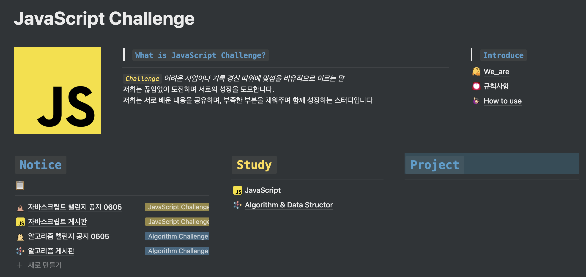

## TIL 🧑🏻‍💻Today _ I _ Learn
✏️  **매일매일 성장하는 기록을 담은 레파지토리 입니다.**

--------
- **Javascript ~ ing**
- **Algorithm ~ ing**
- React - 학습 예정
- git - 학습 예정
---
## **Javascript**
>## Dream Coding Ellie
 

</img>

 

- [드림코딩 학습 노트 1 - 변수 , 데이터타입](https://blog.naver.com/goawmfhfl1/222337915001)
- [드림코딩 학습 노트 2 - 연산자 (operate, if, for loof)](https://blog.naver.com/goawmfhfl1/222340080322)
- [드림코딩 학습 노트 3 - 함수 선언](https://blog.naver.com/goawmfhfl1/222341108210)
- [드림코딩 학습 노트 4 - Class 객체지향언어](https://blog.naver.com/goawmfhfl1/222342884728)
- [드림코딩 학습 노트 5 - Object](https://blog.naver.com/goawmfhfl1/222343702791)
- [드림코딩 학습 노트 6 - Array](https://blog.naver.com/goawmfhfl1/222348019526)
- [드림코딩 학습 노트 7 - 배열에서 자주 쓰는 함수](https://blog.naver.com/goawmfhfl1/222349614347)
- [드림코딩 학습 노트 8 - JSON 개념 정리](https://blog.naver.com/goawmfhfl1/222350916479)
- [드림코딩 학습 노트 9 - 비동기 처리 , callback](https://blog.naver.com/goawmfhfl1/222354478967)
- [드림코딩 학습 노트 10 - Promise 개념 및 활용](https://blog.naver.com/goawmfhfl1/222356214171)
- [드림코딩 학습 노트 11 - async & await](https://blog.naver.com/goawmfhfl1/222357622815)
---
 

>## 생활코딩
 

</img>

 

- [객체지향 프로그래밍 - why we need prototype?](https://blog.naver.com/goawmfhfl1/222385620281)
- [객체지향 프로그래밍 - Class inheritance](https://blog.naver.com/goawmfhfl1/222385647653)
- [객체지향 프로그래밍 - Class 상속 super !](https://blog.naver.com/goawmfhfl1/222385666271)
- [객체지향 프로그래밍 - 객체 상속 Object.prototype vs __ proto __](https://blog.naver.com/goawmfhfl1/222385753028)

---
 

>## JavaScript Study
 
<a href = "https://www.notion.so/JavaScript-Challenge-d6b9a65deb9d4919aed3d8f7e817f5c7">
</img>
</a>
 

- [Mark Down 공유 test](test.md)
- [자바스크립트 첼린지 5월 3주차 학습 피드백](https://www.notion.so/5-3-eb1112cbb83843f194f833ab3d6ca857)
- [자바스크립트 첼린지 6월 1주차 학습 피드백](https://www.notion.so/6-1-a2a1d5fda8cb493a8ae37768e7180973)
---
 

## **Algorithm**
>## 매일 매일 2문제씩 풀기!
 

</img>

 

- [알고리즘 문제1 - 세 수 중 최솟값 구하기, 삼각형 판별하기](https://blog.naver.com/goawmfhfl1/222379714283)
- [알고리즘 문제2 - 연필 개수, 1부터 N까지의 합](https://blog.naver.com/goawmfhfl1/222381099270)
- [알고리즘 문제3 - 최솟값 구하기, 홀수](https://blog.naver.com/goawmfhfl1/222382951813)
- [알고리즘 문제4 - 10부제, 일곱난장이](https://blog.naver.com/goawmfhfl1/222384811095)
- [알고리즘 문제5 - A를 #으로, 문자 찾기](https://blog.naver.com/goawmfhfl1/222387355165)
- [알고리즘 문제6 - 대소문자로 변환, 보이는 학생 수](https://blog.naver.com/goawmfhfl1/222391375828)
- [알고리즘 문제7 - 가위바위보, 점수 계산](https://blog.naver.com/goawmfhfl1/222394121528)
- [알고리즘 문제8 - 등수구하기, 격자판 최대합](https://blog.naver.com/goawmfhfl1/222394175969)
- [알고리즘 문제9 - 봉우리, 유효한 팰린드롬](https://blog.naver.com/goawmfhfl1/222399308976)
- [알고리즘 문제10 - 가장 짧은 문자 거리, 자릿수의 합](https://blog.naver.com/goawmfhfl1/222399350253)
- [알고리즘 문제11 - 졸업선물](https://blog.naver.com/goawmfhfl1/222401525528)
- [알고리즘 문제12 - 두 배열 합치기](https://blog.naver.com/goawmfhfl1/222401536100)
- [알고리즘 문제13 - 공통원소 구하기](https://blog.naver.com/goawmfhfl1/222405458619)
- [알고리즘 문제14 - 최대매출](https://blog.naver.com/goawmfhfl1/222406735436)
- [알고리즘 문제14 - 학급 회장](https://blog.naver.com/goawmfhfl1/222408948930)
---
 

>## Study
     
<a href="https://www.notion.so/JavaScript-Challenge-d6b9a65deb9d4919aed3d8f7e817f5c7">
</img>
<a>
 

- [알고리즘 스터디 6월 1주차](https://www.notion.so/8a0a25191e8c4bd68fbd3124a0c6171a)
